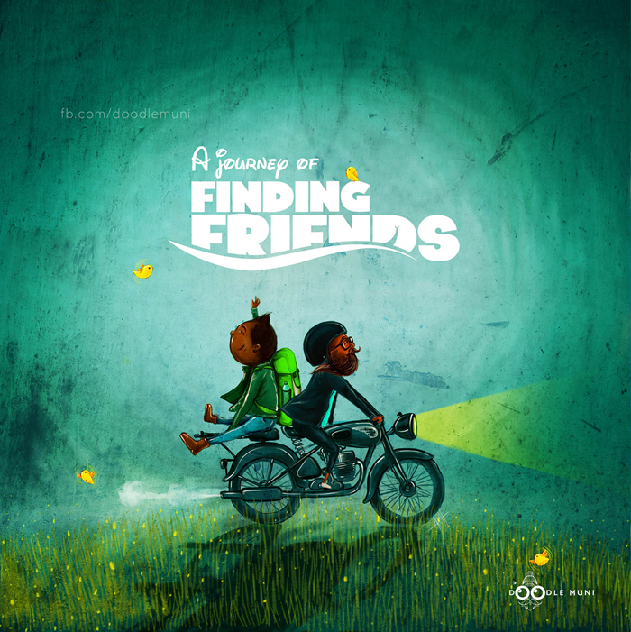

# FriendFinder

### This is a compatibility-based Friend Finder application. This full-stack site will take in results from your survey, then compare your answers with those from other users. The app will then display the name and picture of the user with the best overall match.

### Technology Stack: HTML, CSS, Bootstrap, Node.js, JavaScript, jQuery, Express.js, Heroku

---

### How It Works

- Go to the app's home page at https://friendfinder123-app.herokuapp.com/
- Answer 10 questions on the future of technology on a scale of 1 to 5 based on how much you agree or disagree with the prediction.
- Once you finish and click on `submit`, your response will be stored and automatically compared to the answers from all other users.
- The user with the most compatible profile will be shown, based on our similarity-ranking algorithm.

---
